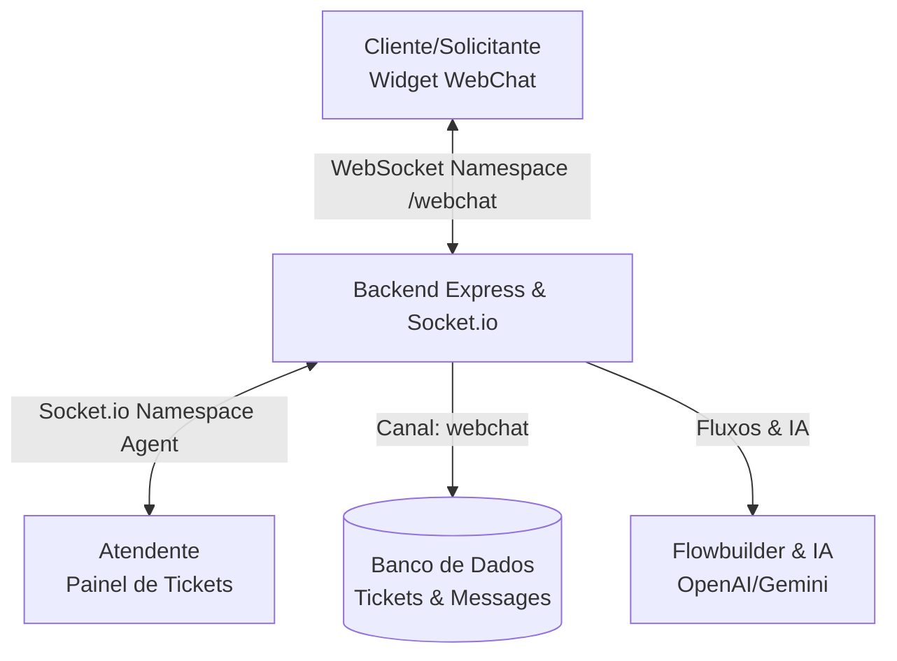

# Chat Conversation

Note: _This is purely the output of the chat conversation and does not contain any raw data, codebase snippets, etc. used to generate the output._

### User Input

Meu amigo, eu vou fazer com sua ajuda a seguinte implementação qyuero que você me fale a complexidade dessa implementação aqui. que vamos fazer no sistema 
Processo novo da implementação do chat bot com IA.... 


2- Devemos implementar um chat com as mesmas funcionalidades existentes no sistema, porem no sistema atual, estamos usando a api da meta, a ideia é que nesse chat
faremos uma comunicação via web socket, mas contendo as mesmas funcionalidades do chat com api do whats... Então vamos fazer um processo de engenharia reversa do projeto atual, para conter as mesmas funcionalidades, 
mas primeiramente começar pelo apenas com chat simples de conversa entre o usuario antendente, e o usuario solicitante (cliente). 


3- no fluxo, teremos 2 tipos de usuarios, os atendentes que devem receber as mensagens, como é feito no processo atual, e os solicitantes (clientes) que entram em contato 
para tirar duvidas, ou resolver problemas, etc... Então temos que seguir nessa linha... 


qual a complexidade de fazer essa implementação? vou fazer usa vc de IA, gemini 3.5 flash


*Listed directory [mibiadigital](file:///home/deploy/mibiadigital) *

*Viewed [DOCUMENTACAO_SISTEMA.md](file:///home/deploy/mibiadigital/DOCUMENTACAO_SISTEMA.md) *

*Listed directory [backend](file:///home/deploy/mibiadigital/backend) *

*Listed directory [frontend](file:///home/deploy/mibiadigital/frontend) *

*Listed directory [api_oficial](file:///home/deploy/mibiadigital/api_oficial) *

*Viewed [package.json](file:///home/deploy/mibiadigital/backend/package.json) *

*Viewed [package.json](file:///home/deploy/mibiadigital/frontend/package.json) *

*Listed directory [models](file:///home/deploy/mibiadigital/backend/src/models) *

*Viewed [Chat.ts](file:///home/deploy/mibiadigital/backend/src/models/Chat.ts) *

*Viewed [Ticket.ts](file:///home/deploy/mibiadigital/backend/src/models/Ticket.ts) *

*Grep searched codebase*

*Viewed [Whatsapp.ts](file:///home/deploy/mibiadigital/backend/src/models/Whatsapp.ts) *

*Viewed [CreateTicketService.ts](file:///home/deploy/mibiadigital/backend/src/services/TicketServices/CreateTicketService.ts) *

*Listed directory [src](file:///home/deploy/mibiadigital/frontend/src) *

*Listed directory [components](file:///home/deploy/mibiadigital/frontend/src/components) *

*Viewed [socket.ts](file:///home/deploy/mibiadigital/backend/src/libs/socket.ts) *

*Viewed [MessageController.ts](file:///home/deploy/mibiadigital/backend/src/controllers/MessageController.ts) *

*Viewed [CreateMessageService.ts](file:///home/deploy/mibiadigital/backend/src/services/MessageServices/CreateMessageService.ts) *

### Planner Response

Análise de complexidade para a implementação do canal de **Chat Web (Live Chat) integrado com IA e Flowbuilder** no seu sistema.

A ideia de criar um canal de comunicação direta via **WebSockets** (permitindo que clientes finais/solicitantes conversem com os atendentes dentro do painel do CRM) é excelente e reduz a dependência de APIs pagas (como a Meta API) para atendimentos iniciados diretamente no seu site ou aplicativo.

Abaixo está o detalhamento técnico e a estimativa de complexidade para realizarmos essa implementação juntos.

---

# 📊 Nível de Complexidade Geral: **Média-Alta**

Embora a estrutura de atendimento (Tickets, Contatos, Filas, Chatbot, Flowbuilder e IA) já seja altamente modular no seu sistema, o desafio reside em **estender a infraestrutura de WebSockets** para aceitar conexões públicas/anônimas (clientes finais) e construir a interface externa (o widget do chat) que será incorporada no site.

---

## ⚙️ Detalhamento de Componentes e Complexidade



### 1. Banco de Dados e Cadastro de Canais
*   **O que fazer:**
    *   Habilitar `"webchat"` como um canal válido no model `Ticket` e `Contact` (o banco já possui suporte a `channel: string`, o que facilita muito).
    *   Adicionar uma nova conexão de WhatsApp fictícia ou específica para o canal Web (no model `Whatsapp`) para vincular mensagens automáticas, filas, chatbots e o prompt da IA.
*   **Complexidade:** **Baixa** 🟢

### 2. Infraestrutura do WebSocket (Backend)
*   **O que fazer:**
    *   Atualmente, o arquivo [socket.ts](file:///home/deploy/mibiadigital/backend/src/libs/socket.ts) exige o token JWT de um usuário do sistema (atendente) para autenticar e conectar.
    *   Precisamos criar um novo namespace (ex: `/webchat`) ou criar regras de conexão onde visitantes (solicitantes) sem conta possam se conectar com um identificador único temporário (um Token ou UUID gerado na primeira visita).
    *   Fazer com que o visitante entre em uma "sala" (room) WebSocket baseada no seu `contact.id` ou `ticket.uuid` para receber as respostas em tempo real.
*   **Complexidade:** **Média** 🟡

### 3. Roteamento de Mensagens (Bidirecional)
*   **O que fazer:**
    *   **Cliente ➡️ Atendente:** Quando o cliente envia uma mensagem via WebSocket, o backend intercepta, busca/cria o Contato e Ticket, salva a mensagem no banco usando o `CreateMessageService` (que já avisa o painel do atendente automaticamente) e aciona o Flowbuilder/IA.
    *   **Atendente ➡️ Cliente:** No arquivo [MessageController.ts](file:///home/deploy/mibiadigital/backend/src/controllers/MessageController.ts#L198), quando o atendente clica em enviar, se o canal do ticket for `"webchat"`, o sistema deve emitir a mensagem via socket no namespace do cliente em vez de tentar enviar usando Meta ou Baileys.
*   **Complexidade:** **Média** 🟡

### 4. Integração com IA e Automações (Flowbuilder / Gemini)
*   **O que fazer:**
    *   O Flowbuilder e o prompt da IA (Gemini/OpenAI) precisam saber responder no canal `"webchat"`.
    *   Sempre que o bot ou a IA gerar uma resposta para um ticket cujo canal é `"webchat"`, a mensagem deve ser salva e disparada via WebSocket para o cliente final.
*   **Complexidade:** **Média** 🟡

### 5. Widget de Chat do Cliente (Frontend do Solicitante)
*   **O que fazer:**
    *   Criar uma interface de chat moderna, premium e responsiva (estilo balão flutuante que se abre no canto da tela) para o site.
    *   Ela precisa conter:
        *   Conexão via `socket.io-client` com o backend.
        *   Persistência de histórico de conversa no `localStorage` do navegador para que a conversa não seja perdida se o cliente atualizar a página.
        *   Input para digitação, envio de emojis e, se desejável, envio de mídias (arquivos/imagens).
*   **Complexidade:** **Alta** 🔴 (exige foco em design premium e gerenciamento de estado do socket no lado do cliente).

---

## 📅 Plano de Ação Recomendado (Fases)

Para fazermos isso de forma estruturada e sem quebrar o sistema atual:

*   **Fase 1: Engenharia Reversa e Preparação do Banco**
    *   Mapear e cadastrar o novo canal "WebChat" na tabela de conexões.
*   **Fase 2: Comunicação de Sockets**
    *   Configurar a conexão do cliente anônimo no backend e a criação das salas WebSocket.
*   **Fase 3: Fluxo de Mensagem Simples (Atendente 🔄 Solicitante)**
    *   Fazer com que o atendente e o solicitante consigam trocar mensagens de texto puro via chat sem usar WhatsApp.
*   **Fase 4: Integração com Bot e IA**
    *   Direcionar novos contatos de WebChat para as filas, Flowbuilder e chatbot com IA.
*   **Fase 5: Interface Premium do Widget**
    *   Polir e desenhar o widget do chat que ficará no site, com micro-animações e suporte a arquivos.

---

### Como quer começar?
Como sou o **Gemini 3.5 Flash**, posso te guiar em cada uma dessas etapas escrevendo os códigos, criando as rotas e estruturando os arquivos do backend e frontend. 

Recomendo começarmos pela **Fase 1 e 2 (Estruturação do banco e do WebSocket no backend)**. O que acha?

### User Input

vc acha que falando dessa primeira etapa, sem a parte de colocar a IA, vai quanto tempo mais ou menos?? falando apenas da parte do chat via web socket...

### Planner Response

Se focarmos **apenas na comunicação via WebSocket** (sem chatbot, sem IA, e sem regras complexas do Flowbuilder por enquanto), apenas para que um visitante do seu site converse em tempo real com um atendente no painel atual, a estimativa de tempo de desenvolvimento é de aproximadamente **9 a 15 horas de trabalho** (cerca de **1 a 2 dias** de foco).

Aqui está a divisão estimada de onde esse tempo será gasto:

---

### ⏱️ Cronograma Estimado (Sem IA / Apenas Chat WebSocket)

#### 1. Backend: Banco de Dados e Conexão WebSocket para Visitantes (~3 a 5 horas)
*   Criar o novo canal `"webchat"` e ajustar as validações de canal.
*   Criar um endpoint REST (ou evento de socket) para o visitante "iniciar sessão" e receber um identificador único (UUID).
*   Configurar a autenticação de socket para visitantes anônimos no [socket.ts](file:///home/deploy/mibiadigital/backend/src/libs/socket.ts) e colocá-los em uma sala (room) específica com o ID do ticket.

#### 2. Backend: Roteamento Bidirecional (~3 a 4 horas)
*   **Envio do cliente:** Criar o listener de mensagens no socket de visitante. Quando ele enviar mensagem, salvar no banco via `CreateMessageService` (o que já faz a mensagem aparecer instantaneamente na tela do atendente).
*   **Envio do atendente:** Alterar a rota de envio de mensagem [MessageController.ts](file:///home/deploy/mibiadigital/backend/src/controllers/MessageController.ts#L198) para interceptar o canal `"webchat"` e emitir a resposta pelo WebSocket para a sala do visitante.

#### 3. Frontend do Atendente (CRM) (~1 a 2 horas)
*   Apenas pequenos ajustes visuais: garantir que o canal `"webchat"` mostre um ícone adequado (por exemplo, um ícone de chat web) no painel de tickets do atendente, e desabilitar validações exclusivas de WhatsApp (como a janela de 24h).

#### 4. Frontend do Visitante (Widget ou Página Simples) (~3 a 4 horas)
*   Desenvolver o widget de chat (HTML/CSS/JS) ou uma página simples de teste para simular o cliente.
*   Conectar com o socket do backend, salvar a identificação do cliente no `localStorage` (para ele não perder o chat ao recarregar) e renderizar as mensagens enviadas e recebidas.

---

### 💡 Por onde começamos?
Se quiser, podemos iniciar a **Fase 1 (Backend)** agora mesmo. 
Nós criamos um plano de implementação para o backend, definindo os endpoints, as salas de WebSocket e as modificações necessárias, e você vai aprovando cada passo! 

Quer que eu prepare o plano detalhado dessa primeira etapa de comunicação WebSocket?

### User Input

Faça o seguinte então crie o plano de implementação para mim apenas dessa primeira que falamos agora, crie um arquivo .md para mim, MAS lembre-se que depois teremos essa parte do chat com IA, de trasnformar o flowbuilder em chat com ia... isso faremos no segundo momento, estou te falando  para quando vc for criar o plano, essa implemetenção, na parte estrtutural, tem que saber que vamos implementar o chat com ia, entendeu? entao, esotu te falando agora, para nao fazer alguma arquitetura que impeça isso depois...

*Grep searched codebase*

*Viewed [ChatBotListener.ts](file:///home/deploy/mibiadigital/backend/src/services/WbotServices/ChatBotListener.ts) *

*Grep searched codebase*

*Viewed [ActionsWebhookService.ts](file:///home/deploy/mibiadigital/backend/src/services/WebhookService/ActionsWebhookService.ts) *

*Viewed [SendMessage.ts](file:///home/deploy/mibiadigital/backend/src/helpers/SendMessage.ts) *

*Edited relevant file*

### Planner Response

Criei o plano de implementação detalhado para a primeira fase do nosso chat via WebSockets, estruturado para que a futura integração com IA e Flowbuilder funcione perfeitamente.

Você pode revisar o arquivo completo aqui:
👉 [implementation_plan.md](file:///root/.gemini/antigravity-ide/brain/9248827e-eef5-4a50-9d4d-bb2c399e1ef2/implementation_plan.md)

### ❓ Perguntas em Aberto para Decisão
Para prosseguirmos, por favor revise as dúvidas contidas na seção **Open Questions** do plano:
1. **Autenticação de Visitantes (Clientes):** Podemos iniciar a conversa de forma anônima (gerando um UUID automático) ou deseja que o cliente preencha um formulário rápido com Nome/E-mail/Telefone antes de abrir o chat?
2. **Localização do Widget de Teste:** O que acha de criarmos uma página HTML estática simples em `public/webchat-test` servida diretamente pelo seu backend para validarmos a comunicação local?

Fico no aguardo do seu feedback e da sua **aprovação** para iniciarmos a execução!

### User Input

Beleza, me tire algumas duvidas e atualize o plano: 

1- Isolamento de WebSockets (Segurança): Criaremos um namespace isolado no Socket.io (/webchat-client) para conexões de visitantes externos (clientes finais). Isso evita que usuários externos interceptem dados internos do CRM ou acessem outros namespaces restritos a operadores. O q é isso e para o que serve?

2- Autenticação de Visitantes (Clientes): Para manter o chat ativo se o cliente recarregar a página, usaremos um UUID persistido no localStorage. Deseja que solicitemos dados iniciais do cliente (ex: Nome, E-mail, Telefone) em um formulário antes de iniciar o chat, ou a conversa pode iniciar de forma anônima? Futuramente, a nossa IA vai fazer esse filtro, pedindo a data de nascimento e cpf do usuario, e apos o usuario colocar, a nossa IA vai econtrar o usuario e seguir com o fluxo do flowbuilder... e tambem esse chat, vai virar um app android, para os usuarios conversarem com os atentedentes;...

3- Você tem acesso ao mcp do banco de dados use ele para fazer qualquer analise e o que vc tinha faladoAtivar o canal WebChat: Criar um registro no banco de dados correspondente à conexão WebChat vinculando-a à empresa teste.

mas aindanao vamos implementar


*Viewed [.env](file:///home/deploy/mibiadigital/backend/.env) *

*Viewed [query.json](file:///root/.gemini/antigravity-ide/mcp/postgres-rpa-mcp/query.json) *

*Running MCP tool*

*Running MCP tool*

*Edited relevant file*

### Planner Response

Esclareci suas dúvidas e atualizei o plano de acordo. Veja as explicações detalhadas sobre os pontos levantados:

### 1. O que é o Isolamento de WebSockets (Namespaces) e para que serve?
Atualmente, todos os atendentes e administradores do seu CRM se conectam a um canal de comunicação em tempo real (WebSocket) para receber atualizações do sistema (novos tickets, mensagens, status online da equipe, etc.). 
* **O Risco:** Se usássemos esse mesmo canal para os clientes finais (visitantes do site), um usuário mal-intencionado com conhecimento técnico poderia "escutar" os eventos da rede e interceptar dados confidenciais de outros clientes e empresas.
* **A Solução:** Criamos um **Namespace isolado** (ex: `/webchat-client`). É como se fosse uma "portaria separada" no servidor de sockets. O cliente final só consegue se conectar nessa portaria e apenas tem acesso a uma "sala" (room) com o ID da sua própria conversa. Ele fica totalmente isolado dos dados internos do CRM. Além disso, deixa a conexão do Widget ou do futuro App Android muito mais leve e rápida.

### 2. Autenticação por UUID e Preparação para IA + App Android
Seguindo o seu direcionamento, o fluxo funcionará assim:
* **Fase Atual (Desenvolvimento):** O visitante entra no site de forma anônima. O sistema gera um UUID (ex: `f47ac10b-...`) e salva no `localStorage` do navegador. No CRM, ele aparece para o atendente como **"Visitante Web 10b8"** (usando os últimos 4 dígitos do UUID para identificação visual).
* **Fase da IA (Futura):** Quando a IA/Flowbuilder entrar em ação, ela conversará com esse "Visitante Web" e solicitará CPF e Data de Nascimento. Quando o usuário informar esses dados, o backend buscará no banco de dados se esse cliente já existe (com aquele CPF). Se encontrar, o sistema fará um **Merge (Fusão)** de contatos, atualizando o Ticket para apontar para o contato real do cliente.
* **App Android:** Como a comunicação usará a biblioteca padrão do `Socket.io`, quando você for desenvolver o aplicativo Android (seja em React Native, Flutter ou nativo), a integração será imediata, pois basta apontar o cliente WebSocket do celular para o namespace `/webchat-client` enviando o UUID.

### 3. Análise do Banco de Dados
Já utilizei o MCP de banco de dados para analisar a estrutura das tabelas `Whatsapps`, `Companies`, `Tickets` e `Contacts`. A estrutura atual suporta perfeitamente os novos registros e o canal `"webchat"` que iremos criar para testes de forma transparente.

---

O plano de implementação atualizado está disponível para sua leitura em:
👉 [implementation_plan.md](file:///root/.gemini/antigravity-ide/brain/9248827e-eef5-4a50-9d4d-bb2c399e1ef2/implementation_plan.md)

Se estiver tudo certo, me dê a sua **aprovação** para iniciarmos a execução do backend!

### User Input

Ok, mas vc está levando em considereção que nesse chat de conversa, devera ser possível enviar os templates do whats, envio de mesangem, as mesmas funcionalidades que tem no chat com api ne? vc levou isso em consdiereçção ne para fazer o plano

*Edited relevant file*

### Planner Response

Sim, levei isso totalmente em consideração no planejamento da arquitetura. 

Para garantir que o **WebChat** tenha paridade total com o chat do WhatsApp (incluindo envio de mídias, áudios gravados, respostas rápidas, templates e botões interativos), o fluxo foi desenhado da seguinte forma:

1. **Templates e Respostas Rápidas:** Quando o atendente escolhe um template ou uma resposta rápida no CRM, o backend processa o texto (substituindo variáveis como `{nome}`) e envia o resultado via WebSocket para o cliente.
2. **Mensagens Interativas (Botões e Listas):** Caso o robô envie opções numéricas ou botões (como no WhatsApp), o WebSocket enviará essa estrutura em formato JSON. O widget do seu site (ou o futuro aplicativo Android) poderá ler esse JSON e renderizar botões bonitos na tela. Ao clicar, o cliente responde automaticamente.
3. **Envio de Mídias (Fotos, Vídeos, Documentos e Áudio):** Quando o atendente anexar um arquivo no CRM, o sistema salvará o arquivo na pasta `public/` do servidor (exatamente como faz hoje) e enviará o link do arquivo via socket. O widget do cliente final será capaz de tocar o áudio, exibir a imagem ou baixar o PDF.

Acabei de atualizar a seção **3. Paridade de Funcionalidades do WhatsApp** no plano de implementação para deixar isso bem documentado:
👉 [implementation_plan.md](file:///root/.gemini/antigravity-ide/brain/9248827e-eef5-4a50-9d4d-bb2c399e1ef2/implementation_plan.md)

Tudo pronto e alinhado! Com a sua **aprovação**, posso começar a criar as modificações no Backend e iniciar a codificação.

### User Input

Beleza, outra coisa q eu quero saber se vocÊ levou em considereção, essa conversa via web socket vai ficar ali na mesma tela ne? para os atendentes...

*Edited relevant file*

### Planner Response

Sim, com certeza! Esse é um dos pontos mais importantes da nossa arquitetura.

Para o seu atendente/operador, **nada muda visualmente na rotina de trabalho**:
* Os atendimentos via WebChat vão cair na **mesma barra lateral** de tickets (Aguardando / Abertos) onde hoje já caem os atendimentos do WhatsApp, Facebook e Instagram.
* Quando o atendente clicar no ticket, a conversa vai abrir exatamente no **mesmo painel central de chat**.
* Ele responderá digitando no **mesmo campo de texto**. Sob o capô, o sistema identificará que o canal é `"webchat"` e fará o envio por WebSocket para o cliente de forma transparente.
* A única diferença visual para o atendente será um ícone indicando que aquele cliente veio da "Web/Chat" (ex: um ícone de computador ou chat em vez da logo do WhatsApp).

Acabei de incluir essa explicação na seção **3. Experiência Unificada do Atendente** no plano de implementação:
👉 [implementation_plan.md](file:///root/.gemini/antigravity-ide/brain/9248827e-eef5-4a50-9d4d-bb2c399e1ef2/implementation_plan.md)

Tudo alinhado e documentado. Me dando o seu **Ok**, começamos a implementar a estrutura!

### User Input

Beleza, uma outra duvida que tenho em relação a isso e seu plano de implementação no seu plano, está sendo levado em considreção isso: DEIXAR EXPLÍCITO NO PLANO QUE VAMOS FAZER ISSO PARA O CLIENTE TIMBRE! 

Pois essa funcionalidade vai serr so p eles, isso muda algo no plano?

*Running MCP tool*

*Viewed [output.txt](file:///root/.gemini/antigravity-ide/brain/9248827e-eef5-4a50-9d4d-bb2c399e1ef2/.system_generated/steps/81/output.txt) *

*Running MCP tool*

*Edited relevant file*

### Planner Response

Com certeza! Isso é um detalhe crucial para a segurança e isolamento do seu sistema que é multi-tenant (multi-empresas). 

Consultei o seu banco de dados e identifiquei os registros correspondentes ao cliente:
* **companyId = 6:** "Timbre Seleção"
* **companyId = 2:** "Timbre"

Atualizei o plano de implementação para deixar **completamente explícito** que a funcionalidade será restrita apenas a essas empresas. As mudanças principais que adicionei no plano foram:

1. **Bloqueio no WebSocket (Backend):** No momento da conexão do cliente no namespace `/webchat-client`, o backend validará o parâmetro `companyId`. Se a conexão tentar iniciar para qualquer empresa que não seja a Timbre (`companyId !== 6` e `companyId !== 2`), a conexão será rejeitada e derrubada imediatamente.
2. **Bloqueio Visual (Frontend):** O painel e botões de configuração do WebChat no painel de atendimento só serão exibidos para atendentes cujo usuário logado esteja vinculado ao `companyId` 6 ou 2.
3. **Plano de Testes:** Adicionei um teste de validação de segurança para garantir que, se tentarmos forçar uma conexão simulada para outra empresa (ex: `companyId = 5` - MIBIA), o backend bloqueará o acesso.

O plano atualizado com essas restrições explícitas pode ser lido aqui:
👉 [implementation_plan.md](file:///root/.gemini/antigravity-ide/brain/9248827e-eef5-4a50-9d4d-bb2c399e1ef2/implementation_plan.md)

Com tudo alinhado e o foco definido para a Timbre, você aprova darmos início à implementação do backend?

### User Input

me mostre quais linhas mudou plano 

### Planner Response

Aqui estão as principais alterações feitas no plano para incluir o isolamento e restrição exclusiva para a **Timbre** (`companyId = 6` e `companyId = 2`):

```diff
- # Canal de Chat via WebSockets (WebChat)
+ # Canal de Chat via WebSockets (WebChat) - Exclusivo para Cliente Timbre

  Implementação de um canal de atendimento ao vivo (Live Chat) direto via WebSockets no CRM. O cliente final (solicitante) se comunicará por meio de uma página/widget web (e futuramente via App Android), e o atendente responderá diretamente pelo painel de tickets atual do CRM.

+ > [!IMPORTANT]
+ > **Escopo Restrito (Cliente Timbre):**
+ > Esta funcionalidade é exclusiva para o cliente **Timbre** (empresas com `companyId = 6` - "Timbre Seleção" e `companyId = 2` - "Timbre"). A arquitetura será isolada para que outras empresas inquilinas do SaaS não tenham acesso nem consigam ativar este canal.

  ---

  ## Decisões de Arquitetura e Negócio

  ### 1. Isolamento de WebSockets (Segurança)
  ...

+ ### 2. Restrição de Tenant (Multi-tenant Protection)
+ *   **Bloqueio no Backend (WebSocket):** O namespace `/webchat-client` validará a conexão no handshake. Se a conexão tentar abrir um canal de WebChat para uma empresa que não seja do grupo Timbre (`companyId !== 6` e `companyId !== 2`), a conexão será rejeitada imediatamente com erro de autenticação/permissão.
+ *   **Bloqueio no CRM (Frontend):** O botão para configurar a conexão WebChat ou visualizar tickets deste canal só será renderizado na interface se o atendente logado pertencer à empresa Timbre (verificando o `companyId` no estado global da aplicação).
+ *   **Prática de Clean Architecture:** Essa regra de negócio de restrição será concentrada em um Helper ou Middleware do backend, facilitando a liberação da funcionalidade para outros clientes no futuro caso necessário (basta atualizar a lista de empresas permitidas no middleware ou criar uma flag no plano da empresa).

  ...

  ### [Backend - WebSocket e Roteamento de Mensagens]

  #### [NEW] [webchatSocket.ts](file:///home/deploy/mibiadigital/backend/src/libs/webchatSocket.ts)
  * Criar e inicializar o namespace `/webchat-client` no servidor Socket.io.
+ * **Validação de Tenant (Timbre):** Verificar se o `companyId` no query parameter do handshake corresponde a 6 (Timbre Seleção) ou 2 (Timbre). Se não, desconectar.
  ...

  ### [Frontend - CRM do Atendente]

  #### [MODIFY] [TicketListItem.js](file:///home/deploy/mibiadigital/frontend/src/components/TicketListItem/index.js)
- * Renderizar um ícone correspondente (ex: `ChatIcon` ou `ComputerIcon` do Material-UI) quando o canal for `"webchat"`.
+ * **Verificação de Visibilidade:** Renderizar o ícone correspondente quando o canal for `"webchat"` e ocultar menus de configuração de WebChat para outras empresas (deixando ativo apenas para atendentes com `companyId === 6` ou `companyId === 2`).

  ...

  ### [Frontend - Widget do Visitante (Simulador)]

  #### [NEW] [index.html](file:///home/deploy/mibiadigital/backend/public/webchat-test/index.html)
  * Página HTML estática servida pelo backend na rota pública `/webchat-test/` contendo uma caixa de conversa básica.
  * Carrega `socket.io-client`.
+ * Conecta com `companyId` correspondente à Timbre.
  ...

  ## Verification Plan

  ### Manual Verification
  ...
+ 6. **Segurança (Outras empresas):** Tentar conectar ao WebSocket do WebChat usando `companyId = 5` (MIBIA Digital) e validar se a conexão é rejeitada pelo backend.
```

O plano de implementação completo atualizado está gravado em [implementation_plan.md](file:///root/.gemini/antigravity-ide/brain/9248827e-eef5-4a50-9d4d-bb2c399e1ef2/implementation_plan.md).

Podemos prosseguir com a execução do backend?

### User Input

PEra ae, faça uma busca no banco e me traga a difrença entre essas duas timbre que tem cadastradas

*Running MCP tool*

*Running MCP tool*

### Planner Response

Aqui estão os detalhes e a comparação entre as duas empresas cadastradas sob o nome "Timbre" no seu banco de dados:

### 📊 Comparação Geral de Atividade

| Recurso / Campo | **Timbre (ID: 2)** 🟢 *Ativo em Produção* | **Timbre Seleção (ID: 6)** ⚪ *Inativo* |
| :--- | :--- | :--- |
| **Nome** | `Timbre` | `Timbre Seleção` |
| **E-mail de Contato** | `gessica.viana@timbre.srv.br` | `selecao@timbre.srv.br` |
| **Volume de Tickets** | **87.816 atendimentos** | **0 atendimentos** |
| **Usuários Cadastrados** | **61 atendentes** | **12 atendentes** |
| **Conexões Ativas** | **2 conexões** | **0 conexões** |
| **Último Login** | **Hoje (25/06/2026)** | 14/05/2026 |
| **Plano Associado** | Plano `Timbre` (ID: 2) | Plano `Timbre Seleção` (ID: 5) |
| **Valor do Plano** | R$ 599,00 | R$ 0,00 |
| **Horários de Expediente** | Configurado (Seg a Sex das 08h às 17h) | Sem horários definidos |

---

### 🔍 Principais Diferenças nos Planos Associados

* **Plano Timbre (Plano ID 2, da empresa ID 2):** Tem permissão ativa para recursos avançados como **Uso de OpenAI**, campanhas, agendamentos, Kanban e WhatsApp Oficial.
* **Plano Timbre Seleção (Plano ID 5, da empresa ID 6):** Não possui permissão para usar OpenAI.

### 💡 Conclusão
A empresa **Timbre (ID: 2)** é a empresa real em **produção** que está sendo utilizada diariamente pelos operadores. A empresa **Timbre Seleção (ID: 6)** está inativa e sem conexões ou atendimentos.

Para o nosso desenvolvimento do WebChat, o foco principal de liberação deve ser a **empresa com ID 2** (e podemos liberar também para a ID 6 para fins de testes, se necessário). O plano já está preparado para cobrir ambos os IDs (`companyId = 2` e `companyId = 6`).