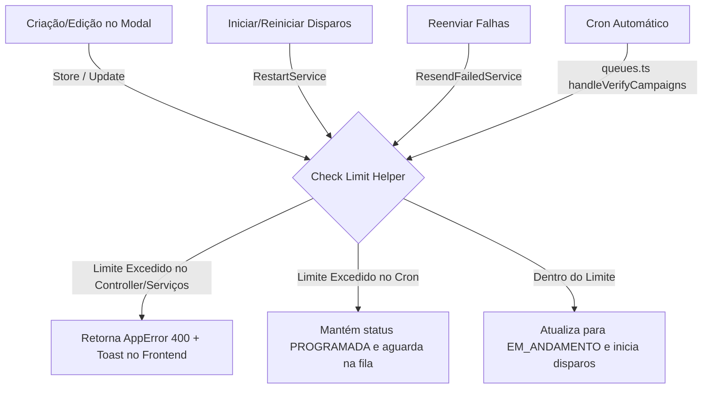

# Documentação: Limitação de Campanhas Simultâneas por Dia por Cliente

Esta documentação descreve a implementação, a lógica técnica e o comportamento da funcionalidade de limitação de campanhas simultâneas em andamento no mesmo dia para um mesmo cliente (empresa).

---

## 1. Objetivo da Regra de Negócio

Para evitar sobrecarga no servidor de envio e proteger a saúde das conexões de WhatsApp dos clientes contra banimentos, foi definida a seguinte regra:
* **Cada cliente (empresa/`companyId`) pode ter no máximo 4 campanhas rodando simultaneamente (com status `EM_ANDAMENTO`) por dia.**
* Se um cliente tentar iniciar ou criar uma 5ª campanha para o mesmo dia, o sistema impede a ação e exibe um alerta de erro.
* Campanhas agendadas para o futuro (que ficam como `PROGRAMADA`) não concorrem ao limite até que o horário delas chegue e elas tentem iniciar.
* Caso as 4 campanhas simultâneas ativas sejam concluídas (mudando para `FINALIZADA` ou `CANCELADA`), novas campanhas na fila de espera iniciam automaticamente.

---

## 2. Abordagem Arquitetural (Clean Architecture)

Seguindo os princípios de modularização e baixo acoplamento, a lógica de contagem foi centralizada em um helper utilitário de banco de dados e integrada nos diferentes pontos de entrada do ciclo de vida das campanhas.

### Fluxo de Validação


---

## 3. Arquivos Criados e Modificados

### 3.1. [Novo Helper] `CheckCampaignLimit.ts`
* **Caminho:** `backend/src/helpers/CheckCampaignLimit.ts`
* **Função:** Centraliza a query do Sequelize para contar quantas campanhas do mesmo `companyId` com status `EM_ANDAMENTO` estão agendadas para a data alvo (truncando a hora e comparando apenas ano-mês-dia).
* **Código:**
```typescript
import { Op, fn, col, where } from "sequelize";
import moment from "moment";
import Campaign from "../models/Campaign";

export async function CheckCampaignLimit(
  companyId: number,
  scheduledAt: Date | string | null | undefined,
  excludeCampaignId?: number
): Promise<boolean> {
  const targetDateStr = scheduledAt
    ? moment(scheduledAt).format("YYYY-MM-DD")
    : moment().format("YYYY-MM-DD");

  const whereCondition: any = {
    companyId,
    status: "EM_ANDAMENTO",
    [Op.or]: [
      where(
        fn("date", col("scheduledAt")),
        "=",
        targetDateStr
      ),
      where(
        fn("date", col("nextScheduledAt")),
        "=",
        targetDateStr
      )
    ]
  };

  // Evita contar a própria campanha em caso de atualização
  if (excludeCampaignId) {
    whereCondition.id = { [Op.ne]: excludeCampaignId };
  }

  const count = await Campaign.count({
    where: whereCondition
  });

  return count >= 4;
}
```

### 3.2. Controller de Campanhas
* **Caminho:** `backend/src/controllers/CampaignController.ts`
* **Implementação:**
  * **No método `store` (Criação):** Executa o check antes de persistir a campanha.
  * **No método `update` (Edição):** Executa o check passando o ID da própria campanha a ser excluído da contagem, evitando falhas ao salvar alterações básicas de texto de uma campanha que já esteja em andamento.
  * **Feedback de Erro:**
    ```typescript
    throw new AppError("Já existem 4 campanhas ativas para este dia. O limite é de 4 envios simultâneos.", 400);
    ```

### 3.3. Serviço de Reinício (Ativação Manual)
* **Caminho:** `backend/src/services/CampaignService/RestartService.ts`
* **Implementação:** Antes de atualizar o status da campanha de `CANCELADA`/`FINALIZADA` para `EM_ANDAMENTO`, valida o limite de envios do dia correspondente ao agendamento dela.

### 3.4. Serviço de Reenvio de Disparos Falhos
* **Caminho:** `backend/src/services/CampaignService/ResendFailedCampaignShippingService.ts`
* **Implementação:** Se a campanha não estava ativa e o usuário solicitar o reenvio de falhas, o sistema valida o limite antes de promovê-la novamente para o status `EM_ANDAMENTO`.

### 3.5. Scheduler de Filas (Cron Automático)
* **Caminho:** `backend/src/queues.ts` (Função `handleVerifyCampaigns`)
* **Implementação:**
  1. Alteramos a query que busca as campanhas pendentes elegíveis para carregar a coluna `companyId`.
  2. Dentro do mapeamento de ativação, chamamos o helper `CheckCampaignLimit`.
  3. Se a empresa já atingiu o limite de 4 campanhas simultâneas, o sistema **não** altera seu status para `EM_ANDAMENTO`. Ela permanece em segurança no status **`PROGRAMADA`** e uma linha de log informativa é registrada no servidor.
  4. Na próxima execução do cron (rodando periodicamente), se alguma campanha ativa já tiver terminado (mudado para `FINALIZADA` ou `CANCELADA`), a vaga estará disponível e a campanha pendente iniciará de forma 100% automatizada.

---

## 4. Tratamento de Erros e Experiência do Usuário (UX)

O tratamento de exceções foi integrado de ponta a ponta com a arquitetura existente do CRM:
1. O backend joga uma exceção `AppError(mensagem, 400)`.
2. A requisição HTTP falha no frontend retornando o status `400` com a mensagem em português.
3. O interceptor global do frontend (`toastError`) captura a resposta de erro da API.
4. Um Toast (alerta flutuante) de cor vermelha é exibido no topo da tela do usuário com a mensagem exata:
   > ❌ **Já existem 4 campanhas ativas para este dia. O limite é de 4 envios simultâneos.**

---

## 5. Verificação e Testes Executados

Executamos uma suíte de testes de integração automatizados conectando-se diretamente ao banco de dados no ambiente do backend, simulando cenários práticos:

1. **Teste de Limite Não Atingido (3 Campanhas):**
   * Criadas 3 campanhas com status `EM_ANDAMENTO` para o dia de hoje.
   * Chamado o helper `CheckCampaignLimit`.
   * **Resultado:** `false` (correto, pois o limite de 4 ainda não foi alcançado).

2. **Teste de Limite Atingido (4 Campanhas):**
   * Criada a 4ª campanha com status `EM_ANDAMENTO` para o dia de hoje.
   * Chamado o helper `CheckCampaignLimit`.
   * **Resultado:** `true` (correto, o sistema detecta que o limite foi saturado e bloqueia novas ativações).

3. **Teste de Atualização de Campanha Ativa:**
   * Chamado o helper passando a exclusão da 4ª campanha.
   * **Resultado:** `false` (correto, permitindo que a campanha ativa seja editada pelo usuário sem disparar o bloqueio contra si mesma).
