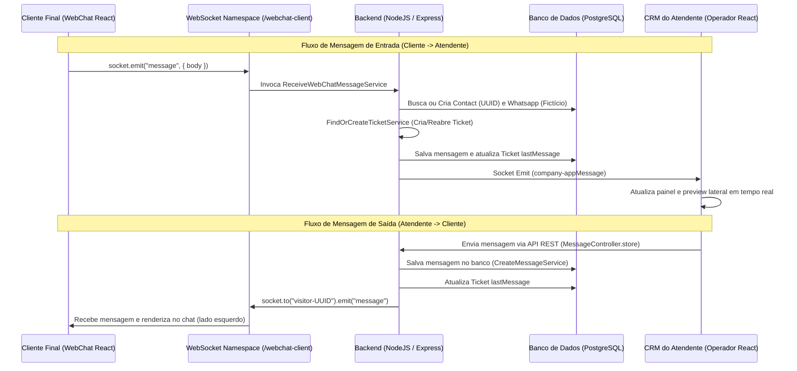

# Documentação Técnica: Canal de WebChat via WebSockets

Esta documentação descreve detalhadamente a arquitetura, o fluxo de comunicação e as implementações realizadas para o canal de **WebChat via WebSockets** (Fase 1 e Fase 2) na plataforma CRM.

---

## 1. Visão Geral do Canal
O WebChat via WebSockets permite que visitantes anônimos (clientes finais) iniciem conversas de chat em tempo real diretamente a partir de um widget ou página pública, comunicando-se instantaneamente com os atendentes logados no painel de atendimento do CRM.

### Premissas e Segurança:
*   **Restrição de Tenant (Tenant Lock):** O canal de WebChat é exclusivo para as empresas de ID `2` ("Timbre" - Produção) e ID `6` ("Timbre Seleção" - Testes). Conexões de qualquer outro ID de empresa são recusadas no handshake do WebSocket por motivos de segurança.
*   **Sessão por UUID:** Cada visitante possui um identificador único universal (`visitorUuid`) gerado automaticamente e persistido no `localStorage` do seu navegador. Isso permite que a sessão, o histórico e o ticket continuem ativos mesmo após fechar ou recarregar a página.

---

## 2. Arquitetura da Solução

O sistema foi estruturado de forma desacoplada, utilizando **Clean Architecture** e integrando-se nativamente aos serviços existentes no backend e frontend.

---

## 3. Detalhamento das Alterações e Arquivos

Abaixo estão listados todos os arquivos novos e modificados para viabilizar o canal de WebChat.

### 3.1. Backend (Serviços e WebSockets)

| Arquivo | Ação | Descrição |
| :--- | :--- | :--- |
| [`backend/src/libs/webchatSocket.ts`](file:///root/CRM---ULTIMO-TESTE/backend/src/libs/webchatSocket.ts) | **Novo** | Cria o namespace `/webchat-client` no Socket.io. Valida se o `companyId` é permitido (2 ou 6) e se o `visitorUuid` está presente. Aloca o cliente na sala individual `visitor-${visitorUuid}`. Carrega e emite o histórico anterior via evento `history` ao conectar. Ouve o evento `message` do cliente. |
| [`backend/src/libs/socket.ts`](file:///root/CRM---ULTIMO-TESTE/backend/src/libs/socket.ts) | **Modificado** | Importa e inicializa o `webchatSocket` (`initWebChatSocket(io)`) durante o ciclo de inicialização geral de sockets da aplicação. |
| [`backend/src/services/WebChatServices/ReceiveWebChatMessageService.ts`](file:///root/CRM---ULTIMO-TESTE/backend/src/services/WebChatServices/ReceiveWebChatMessageService.ts) | **Novo** | Serviço executado ao receber uma mensagem do cliente final. Busca ou cria uma conexão `Whatsapp` fictícia do tipo `webchat`. Busca ou cria o contato `Contact` temporário associado ao UUID do visitante. Invoca o `FindOrCreateTicketService` nativo do CRM e grava a mensagem. |
| [`backend/src/services/MessageServices/CreateMessageService.ts`](file:///root/CRM---ULTIMO-TESTE/backend/src/services/MessageServices/CreateMessageService.ts) | **Modificado** | Intercepta mensagens de tickets do canal `webchat` enviadas pelo operador (`fromMe: true`) e as dispara para o respectivo cliente final na sala do socket. Adicionada a sincronização do banco de dados que atualiza as propriedades `lastMessage` e `fromMe` do modelo `Ticket` antes de emitir atualizações para o CRM. |
| [`backend/src/controllers/MessageController.ts`](file:///root/CRM---ULTIMO-TESTE/backend/src/controllers/MessageController.ts) | **Modificado** | Ignora a janela de restrição de 24h oficial da Meta na rota `store` se o canal do ticket for `webchat`. Salva e persiste mensagens de texto e mídias diretamente no banco via `CreateMessageService` sem tentar invocar APIs de WhatsApp externas. |

### 3.2. Frontend (CRM do Atendente)

| Arquivo | Ação | Descrição |
| :--- | :--- | :--- |
| [`frontend/src/components/ConnectionIcon/index.js`](file:///root/CRM---ULTIMO-TESTE/frontend/src/components/ConnectionIcon/index.js) | **Modificado** | Mapeia o canal `'webchat'` para desenhar o ícone de chat padrão do Material UI (`ChatIcon` na cor azul) nas listagens e cabeçalhos de tickets do CRM. |
| [`frontend/src/components/MessageInput/index.js`](file:///root/CRM---ULTIMO-TESTE/frontend/src/components/MessageInput/index.js) | **Modificado** | Ajusta a verificação de canais para remover os bloqueios de tempo de janela de 24h do painel do operador caso o ticket selecionado seja do tipo `webchat`. |
| [`frontend/src/components/TicketActionButtonsCustom/index.js`](file:///root/CRM---ULTIMO-TESTE/frontend/src/components/TicketActionButtonsCustom/index.js) | **Modificado** | Alterada a leitura de propriedades (como `disableBot`, `contactWallets`) para ler a partir da prop `contact` em vez de `ticket.contact`. Adicionado o operador de encadeamento opcional `?.` para evitar crashes fatais da tela por propriedades nulas durante o carregamento de tickets. |
| [`frontend/src/components/TagsContainer/index.js`](file:///root/CRM---ULTIMO-TESTE/frontend/src/components/TagsContainer/index.js) | **Modificado** | Adicionadas validações de montagem do componente (`isMounted.current`) antes de chamadas assíncronas do `setTags` e `setSelecteds` para eliminar warnings de memory leak e updates em componentes desmontados. |
| [`frontend/src/components/ModalImageCors/index.js`](file:///root/CRM---ULTIMO-TESTE/frontend/src/components/ModalImageCors/index.js) | **Modificado** | Codifica a URL de mídia usando `encodeURI()` para aceitar espaços e acentos de nomes de arquivo de forma segura no XMLHttpRequest. Envolve o fetch de imagem em um bloco `try/catch` para evitar crashes fatais no React se a mídia falhar no carregamento. |
| [`frontend/public/index.html`](file:///root/CRM---ULTIMO-TESTE/frontend/public/index.html) | **Modificado** | Adicionado polyfill global `` no `<head>` para sanar o ReferenceError fatal de `process is not defined` provocado por bibliotecas legadas no browser. |

### 3.3. Frontend (Interface Pública do Cliente - WebChat)

| Arquivo | Ação | Descrição |
| :--- | :--- | :--- |
| [`frontend/src/routes/index.js`](file:///root/CRM---ULTIMO-TESTE/frontend/src/routes/index.js) | **Modificado** | Registra a rota pública `/webchat/:companyId` mapeando para a página `WebChatPublic` utilizando o `RouterRoute` do React Router padrão para ignorar os redirecionamentos do sistema de login do CRM. |
| [`frontend/src/pages/WebChatPublic/index.js`](file:///root/CRM---ULTIMO-TESTE/frontend/src/pages/WebChatPublic/index.js) | **Novo** | Desenvolve o chat do cliente final. Conecta ao namespace `/webchat-client` do backend. Exibe o status da conexão com animação de bolinha pulsante verde ("Online"). Renderiza balões de mensagens com alinhamentos corretos (cliente na direita, atendente na esquerda), exibe imagens expansíveis em modal, e integra player de áudio para mensagens de voz. |

---

## 4. Correções de Estabilidade e Resiliência

Durante o desenvolvimento das etapas de integração, foram aplicadas correções críticas para garantir que a aplicação não quebre em produção sob alta concorrência:

1.  **Impedimento de Duplicação no Envio:** Ajustado o `handleSend` do cliente para limpar o campo de texto instantaneamente de forma síncrona. A adição da mensagem na tela é feita unicamente pelo listener de sockets global, removendo condições de corrida e garantindo que a mensagem só seja renderizada na tela se for salva com sucesso no banco de dados.
2.  **Proteção contra Null Pointer (Mídia e Contato):** Todas as leituras de propriedades aninhadas de mídias e dados de contatos no painel do atendente foram protegidas com o operador `?.` (Optional Chaining).
3.  **Sanamento de Erros de URL de Mídias:** Adicionado `encodeURI` para que o carregamento de arquivos de mídia (imagens e áudios) com espaços e caracteres acentuados (ex: `ó` em `cópia.png`) não resulte em erro de URL inválida no XMLHttpRequest do navegador.

---

## 5. Como Testar e Validar

### 1. Acesso à Rota de Cliente (WebChat)
Acesse a rota do chat configurada:
*   **Timbre (Produção):** `http://localhost:3000/webchat/2`
*   **Timbre Seleção (Testes):** `http://localhost:3000/webchat/6`
*   **Empresa Bloqueada (Teste de Segurança):** `http://localhost:3000/webchat/5` (Deve bloquear e exibir tela de erro).

### 2. Fluxo Bidirecional
*   Envie mensagens na tela do WebChat e confira a criação do ticket em tempo real na barra de pendentes do CRM.
*   Interaja no CRM do atendente respondendo com textos, imagens ou áudios gravados.
*   Valide se a tela do WebChat recebe os textos de forma alinhada na esquerda, renderiza a imagem clicável e o player de áudio executa o som corretamente.

### 3. Teste de Persistência
*   Envie mensagens de teste.
*   Dê `F5` ou atualize a página do WebChat do cliente.
*   **Resultado esperado:** Todo o histórico anterior de conversas com textos, áudios e imagens será recarregado do banco de dados na tela do visitante imediatamente.
